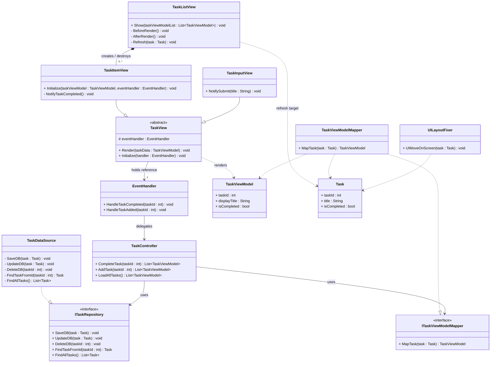

```mermaid

classDiagram

%% =========================
%% View Layer
%% =========================

class TaskView {
    <<abstract>>
    # eventHandler : EventHandler
    + Render(taskData : TaskViewModel) void
    + Initialize(handler : EventHandler) void
}

class TaskItemView {
    + Initialize(taskViewModel : TaskViewModel, eventHandler : EventHandler) void
    - NotifyTaskCompleted() void
}

class TaskListView {
    + Show(taskViewModelList : List~TaskViewModel~) void
    - BeforeRender() void
    - AfterRender() void
    - Refresh(task : Task) void
}

class TaskInputView {
    + NotifySubmit(title : String) void
}

%% 継承
TaskItemView --|> TaskView
TaskInputView --|> TaskView

%% コンポジション（TaskListViewがTaskItemViewを所有）
TaskListView "1" *-- "0..*" TaskItemView : creates / destroys

%% TaskViewはEventHandlerを保持
TaskView --> "1" EventHandler : holds reference


%% =========================
%% Application Layer
%% =========================

class EventHandler {
    + HandleTaskCompleted(taskId : int) void
    + HandleTaskAdded(taskId : int) void
}

class TaskController {
    + CompleteTask(taskId : int) List~TaskViewModel~
    + AddTask(taskId : int) List~TaskViewModel~
    + LoadAllTasks() List~TaskViewModel~
}

%% EventHandler → Controller
EventHandler --> TaskController : delegates


%% =========================
%% ViewModel Layer
%% =========================

class TaskViewModel {
    + taskId : int
    + displayTitle : String
    + isCompleted : bool
}

class ITaskViewModelMapper {
    <<interface>>
    + MapTask(task : Task) TaskViewModel
}

class TaskViewModelMapper {
    + MapTask(task : Task) TaskViewModel
}

TaskViewModelMapper ..|> ITaskViewModelMapper

%% Controller uses mapper
TaskController --> ITaskViewModelMapper : uses


%% =========================
%% Domain Layer
%% =========================

class Task {
    + taskId : int
    + title : String
    + isCompleted : bool
}


%% =========================
%% Infrastructure Layer
%% =========================

class ITaskRepository {
    <<interface>>
    + SaveDB(task : Task) void
    + UpdateDB(task : Task) void
    + DeleteDB(taskId : int) void
    + FindTaskFromId(taskId : int) Task
    + FindAllTasks() List~Task~
}

class TaskDataSource {
    - SaveDB(task : Task) void
    - UpdateDB(task : Task) void
    - DeleteDB(taskId : int) void
    - FindTaskFromId(taskId : int) Task
    - FindAllTasks() List~Task~
}

TaskDataSource ..|> ITaskRepository

%% Controller uses repository
TaskController --> ITaskRepository : uses


%% =========================
%% Dependencies between View and ViewModel / Domain
%% =========================

%% Render uses TaskViewModel
TaskView ..> TaskViewModel : renders

%% Refresh uses Task
TaskListView ..> Task : refresh target

%% Mapper converts Task → TaskViewModel
TaskViewModelMapper ..> Task
TaskViewModelMapper ..> TaskViewModel


%% =========================
%% UI Utility
%% =========================

class UILayoutFixer {
    + UIMoveOnScreen(task : Task) void
}

UILayoutFixer ..> Task


```