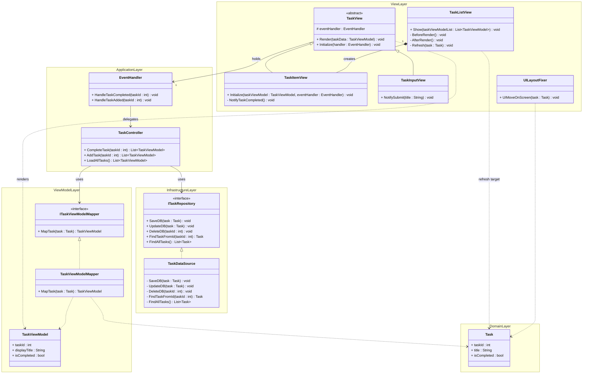

```mermaid

classDiagram
    direction TB

    %% =========================
    %% View Layer
    %% =========================
    namespace ViewLayer {
        class TaskView {
            <<abstract>>
            # eventHandler : EventHandler
            + Render(taskData : TaskViewModel) void
            + Initialize(handler : EventHandler) void
        }
        class TaskItemView {
            + Initialize(taskViewModel : TaskViewModel, eventHandler : EventHandler) void
            - NotifyTaskCompleted() void
        }
        class TaskListView {
            + Show(taskViewModelList : List~TaskViewModel~) void
            - BeforeRender() void
            - AfterRender() void
            - Refresh(task : Task) void
        }
        class TaskInputView {
            + NotifySubmit(title : String) void
        }
        class UILayoutFixer {
            + UIMoveOnScreen(task : Task) void
        }
    }

    %% =========================
    %% Application Layer
    %% =========================
    namespace ApplicationLayer {
        class EventHandler {
            + HandleTaskCompleted(taskId : int) void
            + HandleTaskAdded(taskId : int) void
        }
        class TaskController {
            + CompleteTask(taskId : int) List~TaskViewModel~
            + AddTask(taskId : int) List~TaskViewModel~
            + LoadAllTasks() List~TaskViewModel~
        }
    }

    %% =========================
    %% ViewModel Layer
    %% =========================
    namespace ViewModelLayer {
        class TaskViewModel {
            + taskId : int
            + displayTitle : String
            + isCompleted : bool
        }
        class ITaskViewModelMapper {
            <<interface>>
            + MapTask(task : Task) TaskViewModel
        }
        class TaskViewModelMapper {
            + MapTask(task : Task) TaskViewModel
        }
    }

    %% =========================
    %% Domain Layer
    %% =========================
    namespace DomainLayer {
        class Task {
            + taskId : int
            + title : String
            + isCompleted : bool
        }
    }

    %% =========================
    %% Infrastructure Layer
    %% =========================
    namespace InfrastructureLayer {
        class ITaskRepository {
            <<interface>>
            + SaveDB(task : Task) void
            + UpdateDB(task : Task) void
            + DeleteDB(taskId : int) void
            + FindTaskFromId(taskId : int) Task
            + FindAllTasks() List~Task~
        }
        class TaskDataSource {
            - SaveDB(task : Task) void
            - UpdateDB(task : Task) void
            - DeleteDB(taskId : int) void
            - FindTaskFromId(taskId : int) Task
            - FindAllTasks() List~Task~
        }
    }

    %% =========================
    %% Relationships (関係性をまとめて定義して線を整理)
    %% =========================
    
    %% 継承・実装
    TaskView <|-- TaskItemView
    TaskView <|-- TaskInputView
    ITaskViewModelMapper <|.. TaskViewModelMapper
    ITaskRepository <|.. TaskDataSource

    %% コンポジション・集約・関連
    TaskListView "1" *-- "0..*" TaskItemView : creates
    TaskView --> "1" EventHandler : holds
    EventHandler --> TaskController : delegates
    
    TaskController --> ITaskViewModelMapper : uses
    TaskController --> ITaskRepository : uses

    %% 依存関係 (点線)
    TaskView ..> TaskViewModel : renders
    TaskListView ..> Task : refresh target
    TaskViewModelMapper ..> Task
    TaskViewModelMapper ..> TaskViewModel
    UILayoutFixer ..> Task

```